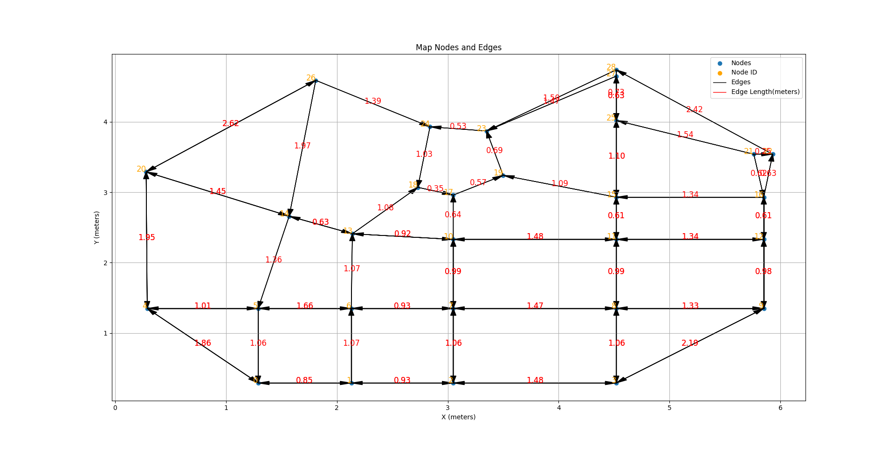

# Road Map Representation
## Libraries Used
- `matplotlib`: just used for plotting the map in `visualize_map.py`.
## To Incorporate
- Add capability of overlaying visualization of TripRequest, ActualTrip, TripRoute, and TripPlan onto the map so that we can visually verify the routes make sense.
- Fix the `map_edges_from_sharepoint_nodes.csv` file since some edges have a length which is shorter than the euclidean distance between their corresponding nodes, currently not an issue as I resolved with with a simple hack as can be seen in the example usage in `map_from_csv.py`.
- Create an enhanced map that differentiates between nodes that have the car facing in different directions for linking multiple paths together, this can be done by making a graph whose nodes are of type Tuple[Node, Edge]. This would allow for more accurate and sensible routing when routing for multiple consecutive trips.
- Or perhaps enhance the existing map by placing more nodes, one node per lane.
- Add capability to load a map directly from the svg file with intersection markings.
## Map Model
Map Dimensions: 
- sources: https://queensuca.sharepoint.com/teams/CCT-938446/SitePages/GPS-and-Fare-System.aspx, https://queensuca.sharepoint.com/teams/CCT-938446/SitePages/The-Town.aspx (see the svg files under Environment-Specs/)
- in feet: $(x,y)\in[0,20]\times[0,16]$ (float single precision)
- in meters: $(x,y)\in[0,6.096]\times[0,4.8768]$ (float single precision)
- origin is positioned in the bottom-left corner of the map

Types (all types are immutable since they inherit from tuple/NamedTuple):
- `rectangular_region.py`: 
    - RectangularRegion: specifies a 2-dimensional rectangular region, 
    - Point2D: tuple of two float, 
    - DirectedSegment: a tuple of Point2D
- `map_types.py`: 
    - MapDimensions = RectangularRegion, 
    - MapRegion = RectangularRegion, 
    - NodeId = int, 
    - EdgeId = int, 
    - Node = Point2D, Used for road intersections, 
    - Edge: represents a lane between two intersections (NodeId->NodeId) and the distance between them (length), 
    - RawMap: stores dimensions of map (for validation), and nodes and edges as tuples, enforces that edge lengths must be at least as long as straight line distance between nodes,
    - AdjListMap: stores an adjancency list of EdgeIds that refer to a RawMap

Functions:
- `rectangular_region.py`: 
    - in_region(region: RectangularRegion, point: Point2D) -> bool, this is used to validate the nodes when creating a RawMap.
    - distance_squared and distance calculate the distance between two points.
- `map_types.py`: 
    - RawMap instance functions edge_id_valid and node_id_valid are mainly used in validation for TripRoute and TripPlan, see `trip_planning_model.py` 
- `map_from_csv.py`:
    - nodes_from_csv and edges_from_csv are used to load the map into the python environment from saved csv files
- `visualize_map.py`:
    - plot_map: function uses matplotlib.pyplot to plot the nodes and directed edges of a RawMap

## Routing Model
(Ride)Fare from the VPFS server API:
```python
{
    "id": int,          # ID of the fare, used to claim it
    "modifiers": int    # Modifiers which apply to the fare. 0=Normal Fare, 1=Subsized Fare, 2=Senior Fare
    "src": {            # Ducky pickup location, in meters from map origin
      "x": float,
      "y": float
    },
    "dest": {           # Ducky dropoff location, in meters from map origin
      "x": float,
      "y": float,
    },
    "claimed": bool,    # True if the fare is already claimed
    "expiry": float,    # Fare expiry, cannot be claimed after this time. In UTC seconds, see python time.time()
    "pay": float,       # Fare payout
    "reputation": int   # Fare reputation gain, in %
}
```

Types `trip_planning_model.py`:
- TripRequest = DirectedSegment, this is the requested trip and can be any point on the map. It must be converted to an ActualTrip before a route can be determined.
- ActualTrip: A TripRequest that is now grounded in a specific map.
- TripRoute: The route itself is just a tuple of edge ids, this object contains a reference to the ActualTrip the route accomplishes.
- TripRouter = Callable[[ActualTrip], TripRoute] 
- TripPlan: Everything about a routed/planned trip on a particular map.

Functions:
- `trip_planning_model.py`:
    - argmin: used in tripRequestToActual when computing the closest points to requested points
    - tripRequestToActual: used to convert a TripRequest to an actual trip on a particular map. Currently O(n) in number of nodes in the map, but could be optimized to O(log n) after some refactoring of the nodes are stored to allow for binary search.
- `floyd_warshall_router.py`:
    - floyd_warshall_router: returns a min trip distance function and TripRouter for a particular AdjListMap. There are some ValueErrors that may be thrown when calling this function or any of its returned functions. 
    - reconstruct_path (not exported): this is used internally by the returned TripRouter.

## Visualization
